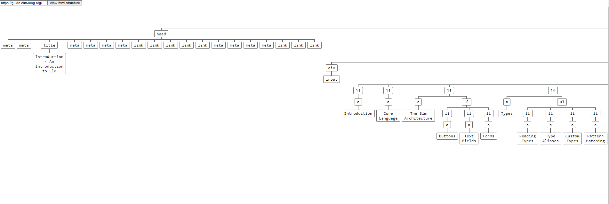

## experimentation with the danneu/html-parser package and scraping test
- Motivation: recenty I used scrapy web scraping tool written in python
- experimentation about how Elm could be used for webscraping purposes
- you can write a webpage into the input
- the application will visualize the html content of the given webpage
- and tries to find a logo in the given webpage
